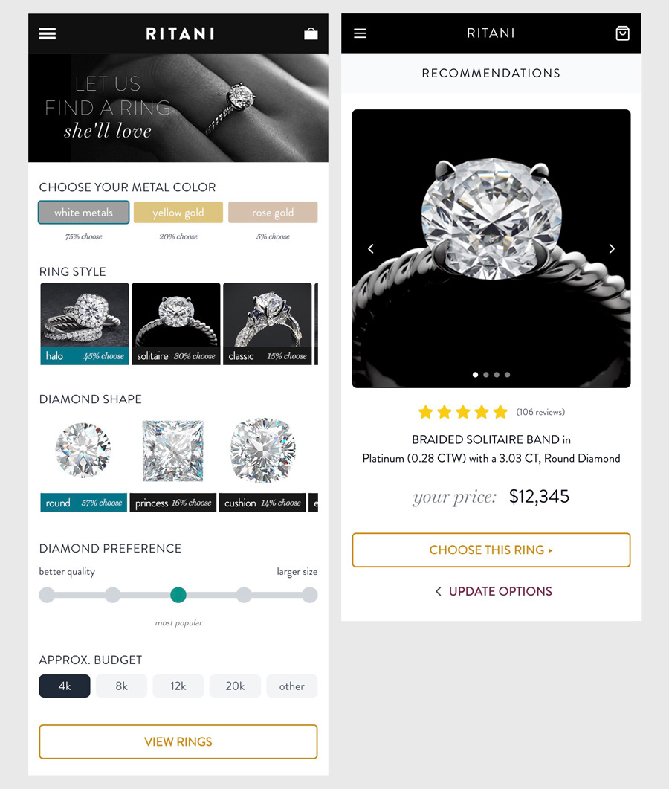

## Prototype: Ring Advisor App 💍
### Visit working prototype: https://ringadvisor.vercel.app/

- Simple prototype for an interactive web app that helps users find the perfect engagement ring based on their preferences.
- Prototype originally built in InVision, now rebuilt using modern web app technologies. 




## 🎨 Designed in Photoshop and Figma
## 🚀 Tech Stack


## ✨ Features

- **Interactive Ring Customization**: Choose from various metal types, ring styles, and diamond shapes
- **Smart Recommendations**: Get personalized ring suggestions based on your preferences
- **Smooth Animations**: Beautiful transitions and interactions powered by Framer Motion
- **Responsive Design**: Optimized for both desktop and mobile devices
- **Touch & Drag Support**: Intuitive carousel navigation with mouse and touch gestures
- **Modern UI**: Clean, elegant interface with custom fonts and styling

## 🛠️ Installation

1. Clone the repository:
```bash
git clone <your-repo-url>
cd ring-advisor-app
```

2. Install dependencies:
```bash
npm install
```

3. Start the development server:
```bash
npm run dev
```

4. Open your browser and navigate to `http://localhost:5173`

## 📁 Project Structure

```
ring-advisor-app/
├── components/
│   ├── ui/                 # Reusable UI components
│   ├── MetalSelector.tsx
│   ├── RingStyleSelector.tsx
│   ├── DiamondShapeSelector.tsx
│   ├── DiamondPreferenceSlider.tsx
│   ├── BudgetSelector.tsx
│   └── RingRecommendations.tsx
├── public/
│   ├── fonts/             # Custom fonts
│   └── images/            # App images and assets
├── styles/
│   └── globals.css        # Global styles and Tailwind config
├── App.tsx                # Main application component
└── main.jsx              # Application entry point
```

## 🎨 Customization

### Adding New Ring Styles
Edit the `ringStyles` array in `components/RingStyleSelector.tsx`:

```typescript
const ringStyles = [
  { 
    id: 'your-style', 
    name: 'Your Style', 
    percentage: 'X% choose',
    image: '/images/your-ring-image.png'
  },
  // ... other styles
];
```

### Adding New Diamond Shapes
Edit the `diamondShapes` array in `components/DiamondShapeSelector.tsx`:

```typescript
const diamondShapes = [
  { 
    id: 'your-shape', 
    name: 'Your Shape', 
    percentage: 'X% choose',
    image: '/images/your-diamond-image.png'
  },
  // ... other shapes
];
```

## 🚀 Build for Production

```bash
npm run build
```
